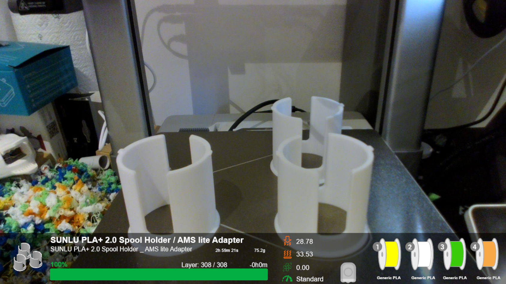

# Bambu2OBS

## Overview
Bambu2OBS is a tool that connects your Bambu Lab 3D printer to OBS Studio, allowing you to monitor and display real-time print progress directly in OBS. Ideal for content creators who want to showcase live 3D printing projects or create timelapses with accurate status updates.

This project integrates Bambu 3D printers with OBS Studio, offering real-time monitoring and display of printing progress. It uses the `pybambu` library for interfacing with Bambu 3D printers and Flask for serving dynamic content.

You can watch live demonstrations of this setup on my [Twitch channel](https://www.twitch.tv/fluidprints), where I monitor my 3D prints.


### Features
- Real-time status updates on printing progress
- SVG integration for visualizing print data
- Configurable through environment variables for easy setup

## Setup and Installation

### Prerequisites

- Python 3.x installed on your system
- OBS Studio for display integration
- InkScape for SVG manipulation

### Setting up a Virtual Environment

It's recommended to use a virtual environment for Python projects to manage dependencies efficiently. Follow these steps to set up and activate a virtual environment:

1. Open a terminal or command prompt.
2. Navigate to your project directory:

    ```bash
    cd path/to/Bambu2OBS
    ```

3. Create a virtual environment named `venv` (or any other name you prefer):

    ```bash
    python -m venv b2obsvenv
    ```

4. Activate the virtual environment:

    - On Windows:

        ```bash
        .\b2obsvenv\Scripts\activate
        ```

    - On macOS and Linux:

        ```bash
        source b2obsvenv/bin/activate
        ```

### Installing Dependencies

With the virtual environment activated, install the required Python packages using:

```bash
pip install -r requirements.txt
```

### Configuration
Copy .env.example to .env and adjust the configuration parameters according to your environment and Bambu 3D printer settings.
### Configuration
In order to connect to your Bambu printer, set the following environment variables in the `.env.example` file and rename it to`.env`:

- **EMAIL**: Your Bambu Cloud account email.
- **PASSWORD**: Your Bambu Cloud account password.
- **REGION**: Set to "China" if using the Chinese Bambu Cloud; otherwise, set to "global".
- **PRINTER_SN**: The serial number of your Bambu Lab printer.
- **PRINTER_IP**: The IP address of your printer on your local network.
- **ACCESS_CODE**: Access code from your printer settings.
- **BASE_DIR**: name of the folder that will store the print job data used for the overlays.

### Running the Application
1. Start the Flask server:

    ```bash
    python .\src\bambu2obs.py
    ```

2. Configure OBS Studio to display the progress bar and SVGs by adding browser sources pointing to the Flask server's URLs.

### Importing the OBS Scene

To make it easier to set up Bambu2OBS in OBS Studio, you can import the pre-configured OBS scene:

1. Download the scene file from the `obs_templates/Bambu2OBS_Scene.json` in this repository.
2. Open OBS Studio.
3. Go to **Scene Collection > Import** and select the downloaded `.json` file.
4. Adjust any necessary settings (e.g., URLs or local paths) within the imported scene to match your setup, especially pointing to the Flask server’s URL for live data.

This imported scene provides an easy way to visualize your print progress in OBS with minimal setup.



### Attribution
This project is open-source under the MIT License. If you use or adapt Bambu2OBS, please provide credit to [fluidman](https://github.com/fluidman) and reference this repository.

Special thanks to Greg Hesp for the `pybambu` library, which facilitates communication with Bambu 3D printers. GitHub repository: [pybambu](https://github.com/greghesp/pybambu).

### License
This project is licensed under the MIT License. See the [LICENSE](LICENSE) file for details.

## About
Bambu2OBS is designed for OBS Studio users who want to display live updates from Bambu Lab 3D printers. This tool supports most Bambu printer models and works best with OBS Studio and Flask, providing a flexible solution for showcasing real-time print progress in streaming setups.